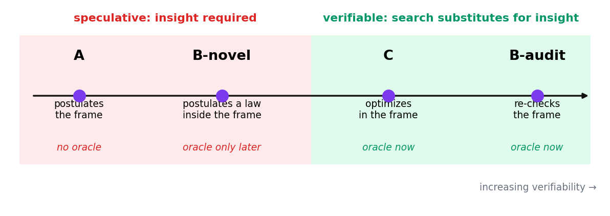
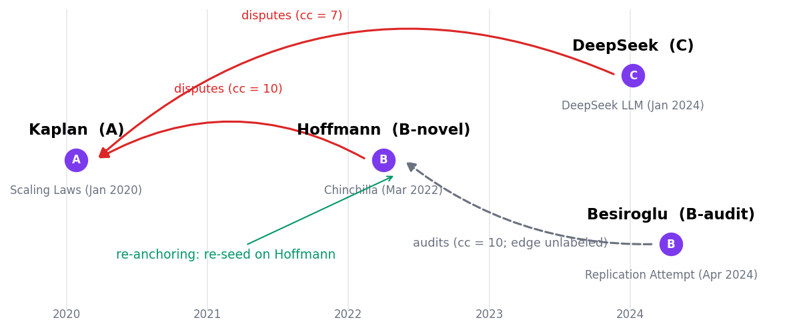
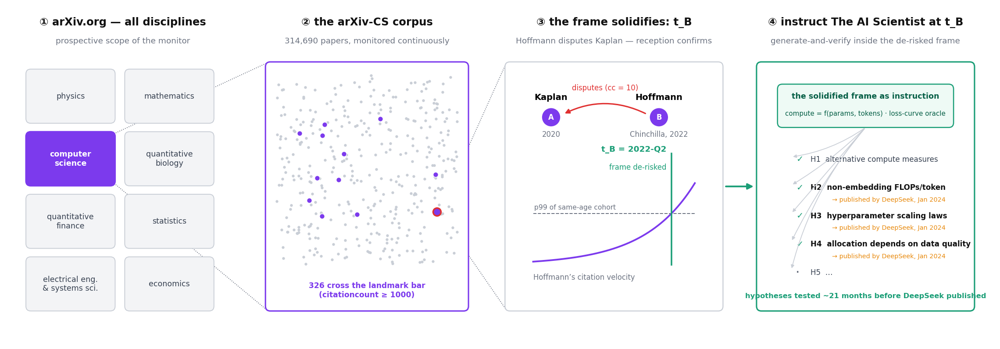
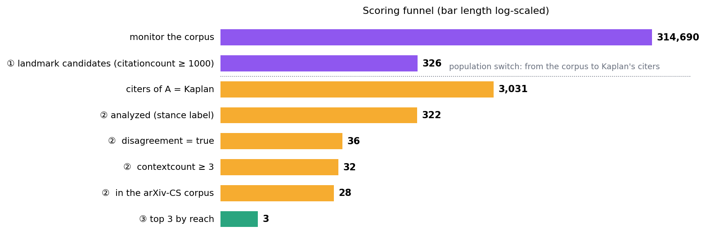
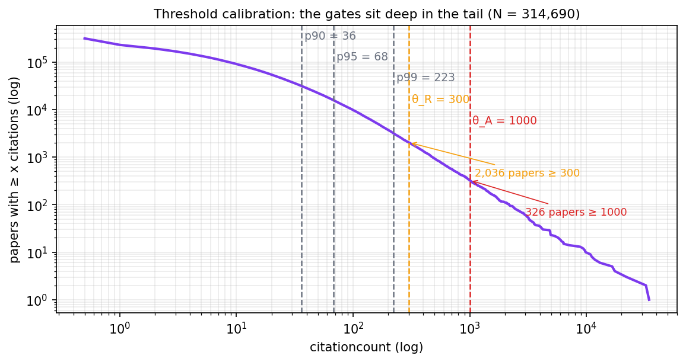
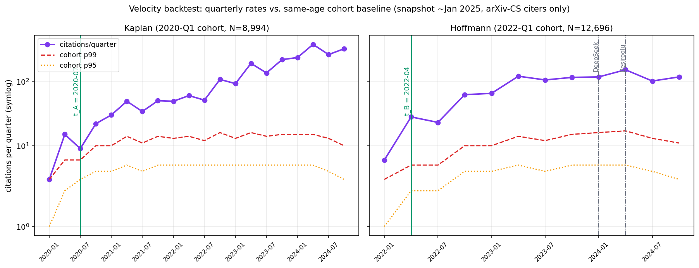
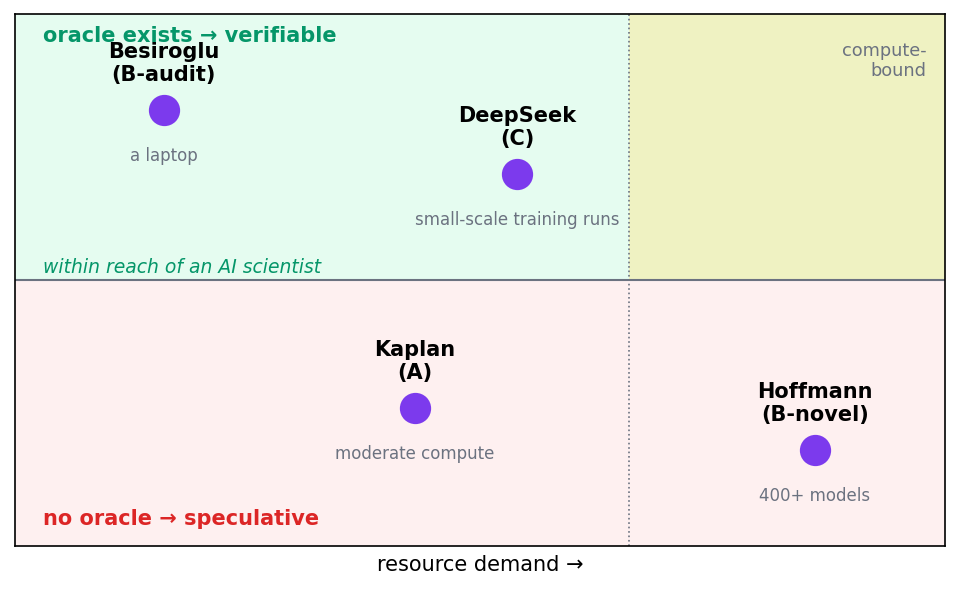

# Where Should *The AI Scientist* Land — and When?

Philipp von Hilgers (flowolf.org)

## Abstract

Automated research systems are improving rapidly, but the strategic question is not whether an AI can do research — it is where in the research enterprise it should act, and when. We develop a selection-and-timing concept for The AI Scientist \[11\] and make it concrete on the evolution of neural scaling laws: Kaplan (2020), Hoffmann/Chinchilla (2022), Besiroglu (2024), and DeepSeek (2024). Reading this chain as a tertius-gaudens structure — a landmark claim (A), a confirming correction (B), and the harvest the two jointly de-risk (C) — we argue that the decisive axis is verifiable vs. speculative novelty: an oracle exists for re-analysis (B-audit) and re-optimization (C), but not for direction-opening (A) and new-experiment correction (B-novel). We show how the chain is extracted from the raw literature by deterministic bibliometrics over Semantic Scholar in-text citation contexts, with a single narrowly-scoped AI judgment (the per-edge stance), and define velocity-based thresholds whose crossing marks the earliest rational entry point, t\_B. A backtest on the January 2025 citation snapshot supports the thesis: the de-risked window for scaling laws opened roughly 21–24 months before DeepSeek and Besiroglu made their moves. We conclude that automated scientists should be pointed at the verifiable roles — audit and optimization — while direction-opening remains, for now, human.

Code and data: companion repository tertius-gaudens — all data, scripts, and intermediate dumps (§10), available at https://github.com/flowolforg/tertius-gaudens. Data vintage: citation/discourse snapshot \~January 2025; case papers 2020–2024.

## 1\. Introduction

Automated research systems are improving quickly, but the strategic question is less “can an AI do research?” than “where in the research enterprise should it act?”. This paper positions itself as a complement to the concept of The AI Scientist \[11\], whose approach to idea generation is still generic and insufficiently differentiated.

In AI research one can observe that the research enterprise and its preprint publication activity are not separate, temporally sequential events but tightly interlocked. The preprint platform arXiv has a large share in this, as Karpathy \[12\] has argued in a podcast. One uploads a preprint there, and within minutes the community reads, tweets, and cites — the months-long journal loop is bypassed, while an arXiv paper still carries a semi-official weight a blog post does not. Two features make AI research an unusually good fit for this model: verifiability — machine-learning results are cheap to reproduce, so a claim uploaded today is tried by others tomorrow, who become its arbiter, at least as long as it does not presuppose high costs in compute and training data — and fast, empirical community review. Compared with disciplines where reproducing research results is slow or costly, arXiv works particularly well for AI research. Yet arXiv encounters a limitation precisely in AI research: on the one hand the commercialization of research works against open publication, on the other hand AI-generated research contributions are flooding the platform, pushing the current quality-assurance measures to their limits.

That notwithstanding, arXiv can be described as a kind of playing field: a research paper is an opening move — someone opens a direction; someone else demonstrates a weakness in a further paper and thereby makes the next move; a third party generalizes the correction. These moves are not equally hard, equally risky, or equally automatable. Choosing the right move determines the whole game.

We develop here a concept that positions The AI Scientist effectively in this game, and make it concrete with a case whose arc is now very well traceable in hindsight: the evolution of neural scaling laws. Four papers define it.

  - Kaplan et al. (2020) \[1\] — *Scaling Laws for Neural Language Models.*

  - Hoffmann et al. (2022) \[3\] — *Training Compute-Optimal LLMs* (Chinchilla).

  - Besiroglu et al. (2024) \[4\] — *Chinchilla Scaling: A Replication Attempt.*

  - DeepSeek-AI (2024) \[5\] — *DeepSeek LLM.*

Retrospectively: at which of these points could an AI scientist best have contributed? We argue: at Besiroglu and DeepSeek — the re-analysis and the re-optimization — and not at Kaplan or Hoffmann, the direction-opening and the new-experiment correction. §2 summarizes what each paper actually contributed; §3 abstracts the four roles into a transferable concept and states the precise axis (verifiable vs. speculative novelty); §4 shows how the chain is mined from the raw literature — with deterministic bibliometrics and one targeted use of AI; §5 defines the thresholds whose crossing is the starting gun; §6 analyzes role-by-role what is in reach and what is not; §7 sketches the emerging research landscape; §8 concludes; §9 turns the framework on this paper itself.

## 2\. Four insights: what Kaplan, Hoffmann, Besiroglu, and DeepSeek actually established

| Paper (year)                 | Knowledge gain                                                                                                                                                                   | Role                           | Mode        |
| ---------------------------- | -------------------------------------------------------------------------------------------------------------------------------------------------------------------------------- | ------------------------------ | ----------- |
| Kaplan (2020)                | Loss falls *predictably* with compute, parameters, and data as a power law — model performance becomes forecastable *before* training.                                           | A — opens the direction        | speculative |
| Hoffmann / Chinchilla (2022) | Kaplan’s allocation was suboptimal; for a fixed compute budget, parameters and training tokens should scale *roughly equally*. Established by training 400+ models.              | B-novel — corrects the formula | speculative |
| Besiroglu (2024)             | Re-analyzed Chinchilla’s *own published data* and found the reported parametric fit statistically inconsistent (implausibly tight intervals; not reproducible). No new training. | B-audit — audits the corrector | verifiable  |
| DeepSeek (2024)              | Re-based the scale variable on *non-embedding FLOPs/token* (not parameter count) → cleaner, more transferable scaling fits and practical hyperparameter scaling.                 | C — re-optimizes the frame     | verifiable  |

Read top to bottom, the chain is a dialectic: a bold claim (A), a confirming correction that lands “the right formula” (B-novel), a sober audit that finds the correction itself flawed in parts (B-audit), and a re-optimization that supersedes the whole setup from inside (C). Kaplan and Hoffmann reach beyond the settled record; Besiroglu and DeepSeek work within it. That difference is the paper’s hinge.

Kaplan et al. (2020) \[1\] — the bold claim (A). The paper established that language-model loss falls as a smooth power law in parameters, data, and compute — and thereby invented the yardstick the rest of the chain measures itself against: loss became predictable from budget. Its allocation guidance — grow parameters much faster than data (N\_opt ∝ C^0.73) — set the field’s direction for two years. At the moment of publication the claim had no verifier: its value could not be checked until the field had built the apparatus to check it.

Hoffmann et al. (2022) \[3\] — the confirming correction (B-novel). Chinchilla accepted Kaplan’s frame and corrected it with new evidence: 400+ models trained at scale showed that parameters and tokens should grow in equal proportion (α = 0.34, β = 0.28; N\_opt ∝ C^0.5), and a 70B-parameter model trained on 4× the data outperformed the 280B Gopher. This is the move that landed “the right formula”: it confirmed that the direction matters and gave the problem its precise, well-posed form — at the price of the most expensive and riskiest role in the chain.

Besiroglu et al. (2024) \[4\] — the audit (B-audit). The replication attempt re-derived Chinchilla’s parametric fit purely from Hoffmann’s published numbers, on commodity hardware, and found the reported fit partly flawed: confidence intervals implausibly tight and exponent estimates inconsistent with the paper’s other approaches; the revised fit (α = 0.35, β = 0.37) reconciles them. No new experiment was run — the contribution is interpolation over existing data, checkable the moment it is tried.

DeepSeek-AI (2024) \[5\] — the re-optimization (C). Working entirely inside the now-settled frame, DeepSeek re-parameterized scale itself — non-embedding FLOPs per token instead of parameter count — extended the laws to hyperparameters, and reported that the optimal allocation shifts with data quality. Measured against the fixed yardstick of loss curves, this supersedes the Kaplan/Hoffmann setup from within; its dispute with Kaplan spans seven distinct in-text locations (§4.2).

## 3\. The concept: the *tertius gaudens* triad and the verifiable/speculative axis

### 3.1 The de-risking dialectic

Borrowing Simmel’s tertius gaudens \[8\] — the “rejoicing third” who profits from the configuration of two others — we read the chain as a structural opportunity. Burt \[9\] operationalized this Simmelian figure for network theory as “structural holes”: the third gains by occupying the gap between two actors not directly connected — here, the synthesis gap that A and B jointly open. When a landmark A is confirmed and corrected by a strong B, the direction has been de-risked: it is now known to matter and it has a precise, well-posed form. A third actor C can then execute the radical optimization the formalized problem invites. Unlike Simmel’s rivalry, this is dialectical — A is thesis, B the confirming-corrective antithesis, and the synthesis-shaped opening is the prize. The third takes no side; it harvests the certainty A and B jointly manufactured.

### 3.2 The real axis is verifiable vs. speculative novelty

The question arises which role is best for The AI Scientist: A, B, or C? It is not to be equated with the question of the highest creativity; it targets the verifiability of a research approach at a given moment. The claim is not that the automatable moves are uncreative: DeepSeek’s choice of a non-embedding-FLOPs measure was not obvious. The claim is about epistemic structure:

  - An oracle exists for C and B-audit, not for A and B-novel. Once B has landed the frame, the objective is formalized (compute = f(parameters, tokens), an explicit frontier) and the yardstick is fixed (loss curves). C’s contribution is *checkable the moment it is tried*; Besiroglu’s audit is checkable against Hoffmann’s published numbers. Kaplan had to invent the yardstick first; Hoffmann’s allocation resolved only years later. C and B-audit create on the *decidable* side of the line; A and B-novel wager on undecided terrain.

  - Search substitutes for insight only where an oracle exists. This is the crux. C’s creative choice — which re-parameterization to try — is not mechanically derivable, but it is substitutable by breadth × verification: enumerate the natural compute measures, let the loss curves decide. Where a human used insight to guess, a machine can try-and-check. A has no verifier at the time; there, search cannot replace insight.

  - Bounded vs. unbounded failure. A wrong C merely fails to win (local, recoverable). A wrong A collapses its own premise; a wrong B-novel misleads the whole field. Verifiable novelty has bounded downside; speculative novelty does not.

As a spectrum (Fig. 1):



*Fig. 1: The role spectrum — speculative vs. verifiable novelty. For C and B-audit an oracle exists at the moment of the move; search can substitute for insight.*

The argument rests on the space of useful re-parameterizations being small and searchable enough for the oracle to find the hit. For scale measures (finitely many natural compute definitions) that is plausible; for a genuinely non-searchable architectural leap, C would slide toward A and the claim would weaken. Two further qualifications apply: whether a measure space is searchable is hard to establish ex ante — that it was small is known with certainty only in hindsight. And the oracle is weaker for C than for B-audit: an audit is immediately decidable against published numbers, whereas better scaling fits prove themselves only in extrapolation to larger scales.

### 3.3 The right moment

Why wait until C produces a Sputnik moment? The wait was an artifact of human division of labor — Kaplan→…→DeepSeek took four years because four actors moved in sequence. But B-audit and C are the same machine capability: generate-and-verify against the existing record. An AI agent can audit every landmark paper as soon as it appears as one, and the community should be able to rely on an exhaustive AI-based audit having been performed ahead of publication. It need not wait for a third party to harvest the certainty just manufactured. What stays off-limits, for now, is only the speculative pair, A and B-novel.

### 3.4 From case to method

None of this is specific to scaling laws. Any field that records who disputes whom, and how substantively, exposes the same A→B→C structure. In what follows, the extraction and timing method is laid out in more detail (§4–§5); we then ask which roles an automated agent can actually fill (§6).

### 3.5 Related work: autonomous idea generation

The closest prior system is The AI Scientist \[11\], the first autonomous pipeline to carry a machine-generated paper through blind peer review. Its idea generation, however, is structurally different, and the contrast sharpens what we propose. There, a human code template seeds an iterative loop in which an LLM acts as a mutation operator growing an archive of ideas; each idea carries self-assessed interestingness/novelty/feasibility scores (1–10), and novelty is enforced by discarding proposals too semantically similar to existing work (via the Semantic Scholar API) — under the prompt to be an “ambitious AI PhD student … contributing significantly to the field.” Four differences follow:

  - Novelty as dissimilarity vs. standing as dispute. The AI Scientist equates novelty with semantic distance from prior work. But distance is a weak proxy for value — much of the best work sits close to a landmark and disputes it precisely (Chinchilla is “near” Kaplan and matters because it contradicts it). We read an idea’s standing not from similarity but from who substantively disputes whom — an external structural fact, not a self-report and not a distance.

  - Same data source, opposite use. Both lean on Semantic Scholar. The AI Scientist queries it for dissimilarity (avoid overlap); we use its in-text citation contexts for engagement and dispute — a rarer, sharper signal (§4.3) that separates a landmark’s real critics from its ceremonial citers.

  - No timing. Template mutation proceeds in a temporal vacuum; there is no notion of when a direction is ripe. Our method is timing — the velocity-based starting gun t\_B (§5.2), the moment a direction is de-risked. An idea can be novel and feasible yet premature or already stale; a similarity check cannot tell.

  - Which role is even automatable. Reaching for “significant, novel contributions” implicitly aims at the A role — opening a direction — that is, speculative novelty with no oracle (§3.2), the least automatable act. We argue: the reachable roles are the verifiable ones, B-audit and C, and idea generation should be pointed there.

None of this diminishes the engineering; our claim is narrower and orthogonal — that idea selection and timing, read from the field’s disagreement structure rather than from self-assessed novelty, are where an automated scientist gains traction. This is the sense in which this paper’s title answers the question raised by \[11\]: it names where such a system should land (the verifiable roles, §6) and when (the velocity-based starting gun, §5.2).

Independent empirical support for this role assignment has since arrived from a different direction. Chen, Zhao, and Cohan \[13\] compare 11,683 human research ideas — extracted from machine-learning-conference and Nature Communications papers — with LLM-generated ideas produced from the same reconstructed related-work contexts, and find a stark distributional gap: LLM ideas concentrate on bridge-like gap framings (47–64 % across nine models, vs. 12.1 % for humans) and synthesis/unification methods (22.5–38.7 % vs. 5.1 %), with consistently lower entropy on both axes — reasonable one at a time, yet narrow and template-bound as a distribution. Read on our axis, this is what §3.2 predicts: asked to perform the A-role — to open a direction with no oracle — current systems fall back on integrative recombination of what is already on the table. Chen et al. draw the opposite normative conclusion from the same evidence: for them the narrowness is a distributional-alignment problem, to be trained toward the breadth of human taste. Our framework suggests the complement: rather than training the narrowness away, point it where it is a strength — at the verifiable roles inside a de-risked frame (B-audit and C), entered at t\_B (§5.2). What their evaluation lacks is precisely what this paper supplies: a verifiability axis and a notion of timing.

## 4\. Extracting the chain from the literature pool

The chain is produced by a search-and-rank algorithm over the citation graph: deterministic bibliometrics (no model, fully reproducible) plus one narrowly-scoped AI step — the per-edge in-text stance — precomputed at ingest. Keeping AI confined to that single judgment is deliberate: everything else is auditable arithmetic. A reference implementation ships with the paper (§10).

### 4.1 Sources

  - arXiv (computer science). Categories cs.CV, cs.LG, cs.CL, cs.AI, cs.NE, cs.RO → 314,690 papers (title, abstract, year, publicationdate, citationcount).

  - Observation period: citation graph, discourse layer, and citation counts frozen at the \~January 2025 snapshot; case papers 2020–2024; velocity reference date 2025-01-01.

  - Semantic Scholar citation graph \[7\]. 4,299,126 citation edges — and, decisively, in-text citation contexts: contextcount, the number of distinct in-text locations where a citing paper invokes the cited one, plus the raw context strings for a 60,343-edge subset.

  - > gpt-4o-mini (OpenAI), via the Batch API, JSON mode, temperature 0.1, agreement / disagreement booleans per edge + summaries

The stance labels come from a single system prompt applied per citation edge — the user message is the raw in-text quotation contexts of one citing paper — deciding agreement and disagreement jointly and returning strict JSON with all four discourse fields, so one pass populates agreement, disagreement and both summaries at once. The prompt is, verbatim (original typos preserved):

> The field 'paper' contains quotes from a research paper which refers to a quoted research paper. Your goal is to find **strong disagreement or strong agreement** in the paper. First decide if any of the quotes of the paper show agreement or disagreement. Only if this is true provide a short summary of the agreement or disagreement. You will output a json object: `{ "disagreement": bool, "summary_of_disagreement": str, "agreement": bool, "summary_of_agreement": str }`. Make sure the agreement and disagreement is clearly present in the paper. In case of doubt write rather "none".

Three properties are load-bearing: the criterion is *strong* dis/agreement plus an explicit conservative default (“in case of doubt … ‘none’”), so labels skew toward under- rather than over-calling; the judgment is over the raw quote contexts alone (no title, no author identity), so a label reflects the text, not reputational priors; and the classifier is zero-shot on the schema, with no few-shot exemplars.

The metadata provided by Semantic Scholar contain not only the numeric information of how many places a paper cites another at — already very valuable in itself.[^1] Of even higher value are the text excerpts: the exact wording of the engagement with a cited paper. For example, Semantic Scholar provides the text snippet in which Hoffmann critically engages Kaplan: “Our approach leads to considerably different results than that of Kaplan et al.”

### 4.2 The selection algorithm

Two graph quantities drive the algorithm, and a bare citation count is neither:

  - contextcount — how many distinct in-text locations a citing paper devotes to the cited one. Citing a paper once, in passing, is ceremonial; citing it repeatedly is sustained engagement.

  - stance — whether those in-text mentions *dispute* the cited paper. This is the one AI-judged quantity (§4.1): a plain count cannot tell “\[KMH20\] is wrong about X” from “using the exponents of \[KMH20\].”

The algorithm has three stages:

  - Obtain the landmark A — by monitoring, not querying. The autonomous system does not search for a seed; it monitors the whole corpus and flags any paper that crosses the landmark bar — reception ≥ θ\_A (prospectively: citation *velocity* above the level of other publications in the same discipline; §5.2). A is *detected as it emerges*, not requested. (For a human wanting to inspect a *known* seed, semantic retrieval also works — embed the query \[6\] and rank by 0.7·cosine(query, paper) + 0.3·min(1, citationcount/1000) — but that is a convenience, not the algorithm’s start, and has been exemplarily implemented at flowolf.org.) Here the detected seed is Kaplan.

  - Select the substantive critics. Among the *thousands* of papers citing A, keep only those that both engage A repeatedly (contextcount ≥ 3) and dispute it (disagreement = true). Most citations satisfy neither, so this is a hard cut.

  - Rank by reach. Order the survivors by citationcount, with contextcount as tie-breaker: the focus signal has done its work in the gate (stage 2); the ranking asks only how widely the critic itself is received.

Run on Kaplan, stage 3 returns Hoffmann at rank 1 and DeepSeek at rank 3 — not because anyone curated them, but because each references Kaplan many times (contextcount 10 and 7) and does so to find a flaw (disagreement = true). Out of \~3,000 papers citing Kaplan, the algorithm elevates the field’s canonical corrector (Hoffmann, B-novel) and a later re-optimizer (DeepSeek, C); §4.4 checks this output against the encyclopedia’s canon and marks where it holds and where it does not. The procedure is deterministic given the encoder and the stance labels; §4.3 shows the funnel numerically.

The chain, however, spans two anchors. Kaplan’s critics yield Hoffmann and DeepSeek — both cite and dispute Kaplan. But the auditor Besiroglu does not cite Kaplan at all (no edge in the graph); it disputes Hoffmann (contextcount = 10). So Besiroglu cannot appear in Kaplan’s list; it surfaces only when the same two scores are re-applied with Hoffmann as the new seed — with two caveats: in the present snapshot the edge Besiroglu→Hoffmann carries no stance label (its raw in-text contexts are unmistakably critical, so the gate would find it only after labeling), and Besiroglu’s lifetime citation count (14) is below θ\_R = 300; for a fresh audit to pass the reception bar, the time-normalized gate of the velocity reformulation (§5.2) is needed. The four-node chain is therefore a traversal with re-anchoring — Kaplan → {Hoffmann, DeepSeek}, then re-seed on Hoffmann → {Besiroglu} — not a single ranking.



*Fig. 2: The four-node chain as a traversal with re-anchoring. Red edges: labeled disputes (gate hits); dashed: the audit edge, unlabeled in the snapshot.*

### 4.3 The scoring funnel: monitoring all papers, not querying for one

The proposed system watches the whole corpus and lets an A→B pair *emerge*: a paper that crosses the landmark bar (a *Kaplan-like* A), then a qualified paper that disputes it (a *Hoffmann-like* B).

| Stage                          | Filter (score / gate)                                                                  | Pool                                                                                                          |
| ------------------------------ | -------------------------------------------------------------------------------------- | ------------------------------------------------------------------------------------------------------------- |
| start                          | monitor every paper                                                                    | 314,690                                                                                                       |
| ① landmark-candidate detection | reception ≥ θ\_A (citationcount ≥ 1000; prospectively: velocity above the field, §5.2) | 326 landmark candidates — Kaplan among them                                                                   |
| —                              | take one candidate, A = Kaplan → its citers                                            | 3,031 papers cite Kaplan                                                                                      |
| ② discourse gate               | edge *analyzed* ∧ disagreement = true ∧ contextcount ≥ 3                               | 3,031 → 322 analyzed (10.6 %) → 36 disagreement → 32 (cc ≥ 3) → 28 qualified critics (in the arXiv-CS corpus) |
| ③ salience rank                | citationcount (reach; contextcount as tie-breaker)                                     | Hoffmann \#1, Henighan \#2, DeepSeek \#3                                                                      |



*Fig. 3: From monitoring to entry. ① Every arXiv discipline can be scanned; ② this study instantiates the monitor on the CS corpus, where 326 of 314,690 papers cross the landmark bar; ③ at t_B the reception of Hoffmann’s dispute confirms that Kaplan’s frame matters — the frame is de-risked; ④ The AI Scientist \[11\] is instructed with the solidified frame and generates-and-verifies working hypotheses inside it — ideally surfacing DeepSeek’s findings \~21 months before their publication.*



*Fig. 4: The scoring funnel — from the monitored corpus to Kaplan’s top-3 critics (bar length log-scaled).*

The system is never *told* to look at Kaplan: Kaplan surfaces itself by crossing ①, and Hoffmann surfaces by crossing ②–③. Two of the cuts do the real work, and both are bibliometric, not semantic:

  - The discourse gate ② is the hard filter; the base rate of disagreement per analyzed paper is 5.2 % globally and 11.2 % for Kaplan — in other words: explicit critique is rarely issued.

**Coverage is selective and prominence-biased.** Kaplan’s analyzed rate is not a local accident: for cost reasons the ingest batch did not label the whole graph — of 4.3 M edges just 15.8 % (680,392) were ever analyzed, and the unlabelled \~84 % default to no stance without ever having been examined. The label rate climbs with the cited paper’s citation count (5.6 % under 10 cites → 30.9 % over 1000) and with engagement (contextcount 1 → 10+: 1.5 % → 42.1 %). The operational consequence, recurring throughout: a missing label means “never analyzed,” not “no critique.” We treat coverage as a confidence discount and flag the prominence bias as a limitation. (These coverage figures are computed against the live labeling queue; the shipped snapshot records only outcomes — an analyzed-but-neutral edge is indistinguishable there from an unlabelled one — so the analyzed rate itself is not fully recoverable from it, though every other quantity is.)

**A concrete illustration — the LLaMA anomaly.** LLaMA is the single highest-scored citer of Kaplan in the corpus (contextcount = 3, citationcount ≈ 9,700, product ≈ 29,043 — above the top labelled Kaplan citer, Hoffmann at 15,710), yet the LLaMA→Kaplan edge carries no stance label at all. Were the analyzed sample chosen by score over all of a paper’s citers, LLaMA would rank first and be labelled. That it is not shows the labeling was applied per curated seed-batch, not as a global top-*N* — and the pivotal Besiroglu→Hoffmann audit edge (contextcount = 10) is unlabelled for the same reason, not because Besiroglu fails to engage. Missing labels track what was submitted, not what disputes exist.

  - The salience rank ③ orders what survives by reach — citationcount, with contextcount as tie-breaker; focus has done its work in gate ②. Hoffmann tops it (1,571 citations) over Henighan \[2\] (345); DeepSeek (181) takes rank 3 — ahead of more focused but more narrowly received critics such as “Unified Scaling Laws for Routed Language Models” (148).

So Kaplan → Hoffmann → DeepSeek is A (①) → B (③ \#1) → C (③ \#3) — a deterministic cascade: no theme-clustering, no LLM in the ranking, no query.

The runner-up is an instructive case: Henighan \[2\] is not an external critic but Kaplan’s own team — \[1\] and \[2\] share their core authors (Kaplan, Henighan), and the labeled disagreement (optimal depth-to-width ratio per domain) is a self-refinement on a side theme, not a correction of the allocation claim the chain turns on. For the tertius-gaudens logic this disqualifies it twice over: Simmel’s triad requires distinct actors — an A correcting itself opens no window for a third. The gate should therefore be extended by an author-disjointness filter (authors(A) ∩ authors(B) = ∅), which is deterministically checkable and would sort Henighan out as a matter of course; rank 2 would then fall to DeepSeek.

One caveat suggests itself: stage ① and the salience rank ③ read lifetime citation counts, frozen at the \~January 2025 snapshot. This cascade is therefore retrospective — it reconstructs a finished episode from hindsight, when the papers have already emerged as strongly received. §5.2 swaps lifetime counts for citation velocity to ask the prospective question: how early could a live monitor have detected the same chain — the Kaplan-like A, then the Hoffmann-like B?

### 4.4 Our discourse filter and Wikipedia’s curated discourse filter

Does this scoring manufacture a connection, or find a real one? The external check is Wikipedia’s article Neural scaling law \[10\], which independently canonizes exactly Kaplan (2020) → Hoffmann/Chinchilla (2022) → Besiroglu (2024) — discussing all three with their competing exponents (Kaplan N\_opt ∝ C^0.73; Chinchilla α=0.34, β=0.28, N\_opt ∝ C^0.5; Besiroglu’s revised α=0.35, β=0.37). Our system does not find Besiroglu in the Kaplan pass, because Besiroglu never cites Kaplan and engages exclusively with Hoffmann. Our system could be extended by applying Markov chains to capture implicit references between the papers.

At C, DeepSeek, the system proposed here and Wikipedia diverge — and the divergence is instructive. DeepSeek is not mentioned in the Wikipedia article, but the dispute is real in the data: DeepSeek → Kaplan is a labeled dispute over 7 distinct in-text locations (contextcount = 7) — a substantive engagement the algorithm did not invent. The Wikipedia article organizes scaling laws by the fit lineage — the parametric model L = A/N^α + B/D^β and its exponents — a thread on which Kaplan, Chinchilla, and Besiroglu form a closed line and DeepSeek’s contribution (the non-embedding-FLOPs measure) sits on a different axis. The algorithm organizes by discourse — who substantively disputes whom and who takes whom up — and on that axis DeepSeek plainly belongs. The encyclopedia’s omission is therefore not evidence that the connection is spurious.

## 5\. Signal thresholds: when they fire and why they are the starting gun

### 5.1 The gate

A critique edge B→A is admitted only if disagreement = true, reception R(A) ≥ θ\_A, R(B) ≥ θ\_R, and engagement contextcount ≥ θ\_C. Thresholds are absolute, not relative, so “is this already a signal?” is comparable across the corpus and across time — the property that lets early-but-solid critiques fire. Calibrating on papers.citationcount gives percentiles p90 = 36, p95 = 68, p99 = 223; we set θ\_A = 1000, θ\_R = 300 (both deep in the tail), θ\_C = 3 (retains 74.9 % of disagreement edges; fallback θ\_C = 2 retains 98.3 %).

Conditioning on contextcount is empirically grounded: the probability that an edge is a disagreement rises monotonically with in-text engagement. On analyzed edges only (removing the coverage bias of §4.3) it climbs from 1.6 % at contextcount = 1 to 21.5 % at ≥ 21, a \~13× increase (5.3 % at cc 3, 7.8 % at cc 5, 11.6 % at cc 6–10, 15.9 % at cc 11–20). Depth of engagement is itself a disagreement prior — which is why the gate conditions on contextcount, not on the disagreement flag alone.

Two further gates: a type gate (admit only conceptual\_correction / scope\_limitation, never benchmark\_superiority) and a cheap genre pre-filter on A’s title+abstract. Both are negative screens; neither replaces the disagreement signal.

**A disagreement edge is mostly not disagreement.** The edge-level flag records that criticism is *present* somewhere in an engagement, not that the engagement is adversarial. Classifying the individual in-text contexts of heavily-engaging disagreement edges (a hand-labelled sample of 12 edges / 128 contexts at contextcount 8–20) splits them 50 % neutral (notation, background, methodology-following), 27 % supportive (adopts, follows, builds on A), and only 23 % critical — the critical share never exceeds 44 % on any single edge. A paper that cites A fifteen times does so overwhelmingly to build on A; the dispute is one facet — typically the single point captured in `summary_of_disagreement` — not the purpose of the engagement. This is the per-context basis for the type gate: the actionable signal is the presence and kind of the critical contexts, not their volume. (Sample figures are indicative; a full run over all \~13.3k disagreement edges is left to the shipped script.)



*Fig. 5: Threshold calibration on papers.citationcount: θ\_R = 300 and θ\_A = 1000 sit deep in the tail of the distribution (N = 314,690).*

### 5.2 From retrospective chain to earliest entry: the velocity reformulation

The chain of §4 is retrospective: its salience rank (citationcount, contextcount as tie-breaker) reads lifetime citation counts, frozen at the January 2025 snapshot. Looking back from 2025, the papers are already canonical — the cascade shows the shape of a finished episode, not when to act. The operational question is the opposite: what is the earliest moment an AI scientist should be sent into the field?

Replace lifetime counts with citation velocity — citations per unit time — and the static gate becomes a temporal one:

  - Landmark-candidate condition on A (necessary, not sufficient). A is a landmark candidate from the first moment its citation velocity exceeds the field’s — a high percentile of its contemporaries. Being cited faster than peers per unit time is the necessary early sign; it does not yet guarantee a landmark (the paper may still fizzle). This makes the question precise: from when did Kaplan clear that bar? That timestamp t\_A is the moment Kaplan first *looks* like a landmark — potentially years before its lifetime count makes the status obvious.

  - The same measure on B. From when does Hoffmann’s velocity clear the qualified-critic bar while its conceptual dispute with Kaplan registers? We call that moment t\_B.

  - Earliest entry ≈ t\_B. Not A’s publication (t\_A is a candidate signal only — the direction is still speculative), and not the 2025 hindsight view — but the first moment a velocity-qualified landmark has been met by a velocity-qualified, conceptually disagreeing critic. That is when the direction is de-risked in real time (§3.1): the oracle now exists, and verifiable work — audit, optimization — becomes possible. This is the true starting gun; A’s publication is not.

This is where the connection to The AI Scientist \[11\] becomes operational. Its idea-generation loop is seeded by a human-written code template and mutates ideas in a temporal vacuum, enforcing novelty as semantic distance (§3.5). The starting gun replaces both choices: at t\_B — for scaling laws, mid-2022, once the reception of Hoffmann’s dispute has confirmed that the frame matters — the system would be instructed with the just-solidified frame itself (compute = f(parameters, tokens), the fixed loss-curve yardstick, Hoffmann’s published fits) and directed to formulate and investigate as many working hypotheses inside it as the oracle can adjudicate: alternative compute measures, re-parameterizations, hyperparameter scaling laws, data-quality dependencies of the allocation. In the ideal case, DeepSeek’s findings — the non-embedding-FLOPs measure among them — are surfaced and verified within this fan-out, roughly 21 months before their actual publication (Fig. 3); the caveats of §3.2 (searchability) and §6 (compute access) apply unchanged.

A retrospective approximation of this backtest is available (scripts/backtest\_velocity.py, §10): citation events are dated by the publication dates of the citing papers — only citers within the arXiv-CS corpus are datable, for Kaplan 2,311 of 3,567 citations (\~65 %) — and held, quarter by quarter, against the percentile bands of the same-age cohort (crossing rule: two consecutive quarters above the band). The result supports the thesis: Kaplan clears the p99 band of its 8,994-paper 2020-Q1 cohort sustainably from 2020-Q3 — t\_A lies roughly six months after publication. Hoffmann sits above the p99 of its 12,696-paper cohort practically from publication (2022-03-29); t\_B falls in 2022-Q2. The de-risked window was thus open \~21 months before DeepSeek (January 2024) and \~24 months before Besiroglu (April 2024) — the signal would have fired early (Fig. 6). The true live gate remains data-dependent: it requires continuously refreshed citation data instead of the frozen snapshot.



*Fig. 6: Velocity backtest — citations per quarter vs. p95/p99 of the same-age cohort (snapshot \~Jan 2025, arXiv-CS citers only). Green line: t\_A resp. t\_B; grey lines: DeepSeek and Besiroglu.*

## 6\. What is in reach of an AI scientist — and what is not

Two axes decide reachability: does an oracle exist at the time? and does the move need resources the agent lacks? Compute clusters are scarce and expensive; existing datasets and published results are cheap.



*Fig. 7: Reachability along two axes — oracle existence × resource demand. In reach: the verifiable roles B-audit and C.*

| Paper     | Role    | Oracle at the time?                       | Resource demand                                 | In reach?                            |
| --------- | ------- | ----------------------------------------- | ----------------------------------------------- | ------------------------------------ |
| Kaplan    | A       | No — postulates the frame                 | moderate compute                                | No — needs intuition, no verifier    |
| Hoffmann  | B-novel | No — resolves years later                 | 400+ models — a large cluster                   | No — speculative *and* compute-bound |
| Besiroglu | B-audit | Yes — Hoffmann’s own data                 | a laptop (re-analysis)                          | Yes — cheap, verifiable              |
| DeepSeek  | C       | Yes — loss curves (partly self-generated) | small-scale own training runs (search + verify) | Yes\* — verifiable; *caveat §3.2*    |

  - Kaplan (A) is out of reach. No oracle: the value of “loss is predictable from compute” could not be checked until the field built the apparatus to check it. This is the human-shaped act of intuition — a bet on an undecided question.

  - Hoffmann (B-novel) is doubly out of reach. It is speculative (the allocation claim resolved only later — and was itself faulted, see below), *and* it demanded training 400+ models at scale — empirical compute the agent does not command. New-experiment correction is the most expensive and riskiest role.

  - Besiroglu (B-audit) is the best fit. It re-analyzed Chinchilla’s *published* data on commodity hardware and found a statistical flaw — pure interpolation over existing numbers, immediately checkable. Auditing landmark results at scale is exactly what a tireless, broad agent is good at, and the input (datasets, reported fits) is cheap.

  - DeepSeek (C) is in reach, with the §3.2 caveat. Its contribution is verifiable against the existing yardstick, and its creative choice is reachable by search × verification, *provided* the measure space is searchable; for a non-searchable architectural leap, it slides toward A. Two qualifications: First, DeepSeek trained its own small-scale model series for its fits — the difference from Hoffmann is gradual (less compute), not categorical (no compute); “in reach” therefore presupposes corresponding compute access for the agent. Second, the real case contains B-novel components: the finding that optimal allocation depends on data quality is a new empirical claim, not a search of the fixed frame. The table’s “Yes” therefore holds only for the re-parameterization core.

Empirical support for “B-novel is risky.” Across 218 “correctors” (operationally: papers with citationcount ≥ 300 that issue a disagreement with contextcount ≥ 3 at a landmark with citationcount ≥ 1000) vs. 1,818 similarly-cited (matched, non-corrector) papers with citationcount ≥ 300: correctors are themselves corrected — i.e., are the target of at least one labeled disagreement of any context count — 86.2 % vs. 81.0 % of the time, and attract \~23 % more disagreement per citation (pooled across the group: +22.9 %; as an unweighted mean per paper: +19.4 %). Hoffmann is a case in point: it is the target of 7 qualified disagreements; Besiroglu’s audit would be the eighth, once its edge is labeled — it carries no stance label in the snapshot, but its in-text contexts (contextcount = 10) are unmistakably critical. The corrector gets corrected — which is why the speculative correction is the role to avoid, and the audit the role to occupy.

## 7\. Outlook: a landscape where AI takes C and B-audit

Suppose automated agents reliably occupy the two verifiable roles. Four dynamics follow.

  - Audit becomes continuous and instantaneous. Every landmark is re-derived against its own data as it appears. Errors like Chinchilla’s fit surface in weeks, not the two years it took Besiroglu. The field spends less time building on wrong formulas; the *cost of being wrong in public* rises sharply.

  - Optimization windows compress. The tertius advantage — entering a de-risked frame before the obvious player — erodes when an agent harvests every window the instant B crosses the gate. Returns to a *single* C collapse toward the competitive frontier; the moat migrates from the idea to speed and monitoring infrastructure.

  - The division of labor sharpens along the verifiable/speculative seam. Machines own interpolation (audit + optimization); humans are pushed toward extrapolation — opening directions (A) and staking new experimental claims (B-novel), the roles that need intuition and large compute. The bottleneck *inverts*: verifiable optimization becomes abundant and cheap, so the scarce, valuable input becomes original direction-setting.

  - A self-correcting equilibrium. If audit is free, speculative claims are pressure-tested at once — unfounded B-novel is discouraged, solid A rewarded. If optimization is free and crowded, the prize drifts back to whoever opens the *next* direction. The economy of science re-prices human originality upward precisely because the verifiable work has been automated away.

The risk worth naming: an agent ecosystem that audits and optimizes brilliantly but cannot open directions would, at the limit, polish an ever-finer set of *existing* frames while the supply of new frames depends entirely on humans. Abundance of C is not a substitute for scarcity of A.

## 8\. Conclusion

Where should The AI Scientist land — and when? The answer this paper defends is structural: on the verifiable side of the line — the audit (B-audit) and the re-optimization (C) — and at t\_B, the moment a landmark’s strong critic is itself confirmed by reception and the frame is de-risked. We showed that the roles can be told apart in the raw literature by deterministic bibliometrics plus a single narrowly-scoped stance judgment; that the extracted chain coincides with the field’s canonical spine where an external canon exists (§4.4); and that a citation-velocity backtest would have fired the starting gun for scaling laws roughly 21–24 months before DeepSeek and Besiroglu made their moves (§5.2). The distributional narrowness of current LLM ideation \[13\] is, on this reading, not an alignment failure to be trained away but a comparative advantage waiting to be pointed at the right frame at the right moment. What remains human, for now, is the speculative pair — opening directions and staking new experimental claims — and with it the responsibility for supplying the frames the machines will then exhaust. Two validations remain open, and both lie within reach of the published pipeline: playing the method through on further landmark papers — chains that lead to key concepts beyond the scaling laws of neural models — to test whether the four-role structure and the velocity gate generalize (§4.4 already flags this as the hypothesis a multi-field evaluation must test); and running the monitor against arXiv in near real time, on continuously refreshed citation data instead of the frozen snapshot, so that t\_A and t\_B are detected as they occur rather than reconstructed in hindsight. All data, scripts, and intermediate dumps are openly available at https://github.com/flowolforg/tertius-gaudens (§10).

## 9\. Coda: does *this* paper have landmark quality?

Let us apply our concept to ourselves. This paper is an A-type act: it postulates a frame (the verifiable/speculative axis; the four-role reading of scientific progress) for which no oracle exists today. Its central claims are not checkable against the present record — they are a wager on undecided terrain. By its own thesis, that makes it *speculative novelty*, the one thing an automated scientist could not have produced and could not now certify.

So: is it a landmark? By the very structure it proposes, the paper cannot answer. It becomes one only if (a) it receives reception, and (b) at least one human takes the role of B-novel — confirming-and-correcting it with the new argument or evidence the paper itself lacks (after which a B-audit might re-check that correction, and a C operationalize the method). And — this is the unavoidable point — whether that happens cannot be predicted, because there is no verifier for an A at the moment of the act. The paper manufactures no certainty about itself; only the field, later, can.

Yet reception is determined by many parameters. Kaplan was written with researchers from OpenAI, Hoffmann with researchers from Google DeepMind, the DeepSeek paper comes from DeepSeek: each arrived with institutional recognition and the presumption of elite, highly-selected expertise that pre-paves citation independent of content. The signals this method trusts — citation count, velocity — therefore measure quality entangled with prestige. This paper has different starting conditions. So if it goes uncited, the cause is genuinely ambiguous: low quality, or merely the absence of external preconditions. And the ambiguity is asymmetric — the reasons a paper is *not* received are far more numerous than the reasons it is (obscurity, wrong venue, no network, poor timing, no brand — and, yes, low quality), whereas strong reception concentrates on a few (real merit, amplified by prestige). Non-reception is thus weak evidence of anything; strong reception is the more informative event. The reflexive test the framework proposes is, by this token, biased against exactly the kind of unbranded A-act this paper is.

Which makes the whole argument reflexive: had an AI been able to write this, it would not be a landmark. That it required a speculative leap is exactly what places it beyond the agent’s reach — and in the reader’s, to corroborate or refute.

## 10\. Data & code availability (reproducibility)

Companion repository: <https://github.com/flowolforg/tertius-gaudens>

```
tertius-gaudens/
├── PAPER.md                     # this paper
├── README.md                    # setup, provenance, exact invocations
├── data/
│   ├── top100.json              # 100 ranked A→B triads (gate output)
│   ├── kaplan_critics.json      # all 28 qualified critics of Kaplan + summaries
│   └── backtest_velocity.csv    # §5.2 quarterly curves and cohort bands
└── scripts/                     # read-only against the source graph
    ├── poc_research_ideas.py    # gate + selector (top100 / validate / calibrate)
    ├── diag_contextcount.py     # §4.3 rarity & context-count distributions
    ├── backtest_velocity.py     # §5.2 velocity backtest (t_A, t_B)
    ├── classify_disagreement_contexts.py  # per-context CRITICAL/SUPPORTIVE/NEUTRAL
    └── show_disagreeing.py      # inspect the disagreeing set for any paper
```

Every quantitative claim is reproducible: §4.3 from diag\_contextcount.py; the §5.1 calibration and the top-100 triads from poc\_research\_ideas.py; the velocity tables from data/kaplan\_critics.json; the velocity backtest from scripts/backtest\_velocity.py; the chain edges (§4.2) and the §6 corrector statistics from direct read-only queries (documented in README.md). The graph derives from public sources (arXiv metadata; Semantic Scholar citation graph with in-text contexts); the discourse layer was generated by the models in §4.1.

## References

\[1\] J. Kaplan, S. McCandlish, T. Henighan, et al., “Scaling Laws for Neural Language Models,” arXiv:2001.08361 \[cs.LG\], 2020.

\[2\] T. Henighan, J. Kaplan, M. Katz, et al., “Scaling Laws for Autoregressive Generative Modeling,” arXiv:2010.14701 \[cs.LG\], 2020.

\[3\] J. Hoffmann, S. Borgeaud, A. Mensch, et al., “Training Compute-Optimal Large Language Models,” arXiv:2203.15556 \[cs.CL\], 2022.

\[4\] T. Besiroglu, E. Erdil, M. Barnett, and J. You, “Chinchilla Scaling: A Replication Attempt,” arXiv:2404.10102 \[cs.LG\], 2024.

\[5\] DeepSeek-AI, “DeepSeek LLM: Scaling Open-Source Language Models with Longtermism,” arXiv:2401.02954 \[cs.CL\], 2024.

\[6\] W. Wang, F. Wei, L. Dong, et al., “MiniLM: Deep Self-Attention Distillation for Task-Agnostic Compression of Pre-Trained Transformers,” arXiv:2002.10957 \[cs.CL\], 2020.

\[7\] R. Kinney, C. Anastasiades, R. Authur, et al., “The Semantic Scholar Open Data Platform,” arXiv:2301.10140 \[cs.DL\], 2023.

\[8\] G. Simmel, *Soziologie: Untersuchungen über die Formen der Vergesellschaftung.* Duncker & Humblot, 1908.

\[9\] R. S. Burt, *Structural Holes: The Social Structure of Competition.* Harvard University Press, 1992.

\[10\] “Neural scaling law,” Wikipedia. <https://en.wikipedia.org/wiki/Neural_scaling_law> (accessed 2026).

\[11\] C. Lu et al., “Towards end-to-end automation of AI research” (The AI Scientist), *Nature*, vol. 651, no. 8107, pp. 914–919, 2026. doi:10.1038/s41586-026-10265-5.

\[12\] A. Karpathy, interview, *Lex Fridman Podcast* [\#333](https://lexfridman.com/andrej-karpathy/), “Tesla AI, Self-Driving, Optimus, Aliens, and AGI,” 2022 (arXiv segment ≈ 2:36:37).

\[13\] Z. Chen, Y. Zhao, and A. Cohan, “Measuring the Gap Between Human and LLM Research Ideas,” arXiv:2607.01233 \[cs.CL\], 2026.

[^1]: I thank Gerd Kortemeyer for the idea of restricting the subsequent semantic analysis to these text elements, thereby avoiding analysis of the full text.
